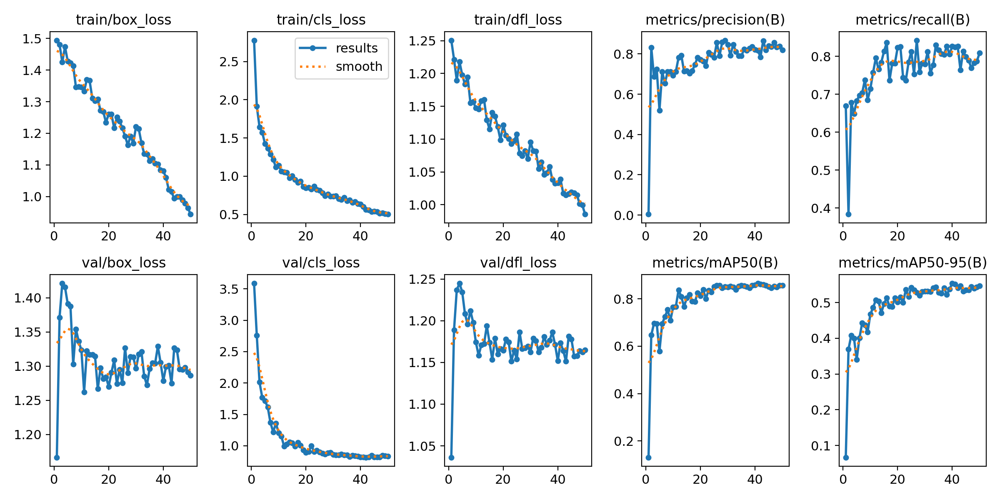

# 🚴‍♂️ Helmet-Detection-YOLOv8: 城市骑行头盔佩戴检测系统

> **Project Status**: Completed (2025.06)  
> **Author**: ShaoKai Shi (Undergraduate, CS Major)  
> **Focus**: Computer Vision, Object Detection, Statistical Evaluation


## 📖 项目背景与动机 (Abstract)

在城市交通管理中，非机动车违规（如不佩戴头盔）是导致交通事故伤亡的重要原因。本项目旨在基于 **YOLOv8 (You Only Look Once)** 架构，构建一个轻量级、高精度的目标检测系统，以实现对骑行者头盔佩戴情况的自动化识别。

作为一个计算机专业的本科生项目，我不仅仅关注模型的最终推理，更着重于**从原始数据清洗到模型量化评估的完整科研链路**。项目中包含了我独立编写的数据预处理脚本，以及对模型在不同 IoU 阈值下表现的详细统计分析。

---

## 🛠️ 方法论与数据管线 (Methodology)

### 1. 数据预处理与清洗 (Data Pipeline)

原始数据来源于 `BikesHelmets` 数据集。为了保证训练的有效性，我编写了 `prepare_data.py` 脚本处理以下核心逻辑：

* **格式转换 (ETL)**：编写解析器将原始的 VOC 格式 (`.xml`) 转换为 YOLO 标准格式 (`.txt`)，并进行坐标归一化。
* **数据集划分 (Stratified Split)**：设定随机种子，严格按照 **8:2** 的比例划分训练集与验证集，防止数据泄露 (Data Leakage)。
* **类别定义**：
    * `Class 0`: With Helmet (佩戴头盔)
    * `Class 1`: Without Helmet (未佩戴头盔)

### 2. 模型配置 (Model Configuration)

出于对**实时性 (Real-time inference)** 的考虑，本项目选用 `yolov8n.pt` (Nano版本) 作为基座模型。

* **Optimizer**: SGD (带有 Momentum, 模拟退火学习率调度)
* **Epochs**: 50 (根据 Loss 收敛曲线确定)
* **Image Size**: 640x640
* **Batch Size**: 16

---

## 📊 实验结果 (Experimental Results)

经过 50 轮的迭代训练，模型（`train4` 版本）在验证集上取得了优异的收敛效果。以下是基于最佳权重 (`best.pt`) 的评估数据：

### 1. 核心指标 (Key Metrics)

| Metric | Value | Description |
| :--- | :---: | :--- |
| **mAP@50** | **85.65%** | 在 IoU=0.5 时的平均精度均值，模型表现优秀 |
| **Precision** | **81.86%** | 查准率，误检率较低 |
| **Recall** | **80.83%** | 查全率，漏检情况控制在理想范围 |
| **mAP@50-95** | **54.69%** | 高 IoU 阈值下的综合表现，体现了边框回归的准确性 |

### 2. 可视化分析 (Analysis)


* **训练过程可视化**：上图展示了模型在50轮训练过程中的性能变化，包括损失函数收敛曲线和评估指标的变化趋势。
* **模型优势**：相比于早期的训练版本（train1-3），最终版本 (`train4`) 通过优化超参数，在模型体积仅为 **6.0MB** 的情况下，实现了精度与速度的最佳平衡（Trade-off）。

---

## 💻 快速复现 (Quick Start)

本项目提供了完整的从数据处理到推理的脚本。

### 环境依赖

```bash
git clone https://github.com/yourusername/Helmet-Detection-YOLOv8.git
cd Helmet-Detection-YOLOv8
pip install -r requirements.txt
```

### 运行流程

1. **数据准备** (解析 XML 并划分数据集):
    ```bash
    python prepare_data.py
    ```
2. **模型训练** (自动下载预训练权重):
    ```bash
    python train.py
    ```
3. **推理测试**:
    ```bash
    # 图片检测
    python predict_photo.py --source data/test_image.jpg
    # 视频流检测
    python predict_video.py --source data/traffic_video.mp4
    ```

### 🤖 模型权重获取 (Model Weights)

#### 方案一：GitHub Release下载 (推荐)
本项目的训练权重已通过 GitHub Release 发布，您可以通过以下方式获取最佳模型权重：

1. **访问 Release 页面**：
   点击本仓库顶部的 [Releases](https://github.com/yourusername/Helmet-Detection-YOLOv8/releases) 标签页

2. **下载权重文件**：
   - 📦 **[v1.0 - YOLOv8 Helmet Detection Model](https://github.com/yourusername/Helmet-Detection-YOLOv8/releases/tag/v1.0)**
   - 下载 `best.pt` (6.0MB) - 最佳性能权重文件

3. **直接使用**：
   ```python
   from ultralytics import YOLO
   
   # 加载下载的权重文件
   model = YOLO('path/to/best.pt')
   
   # 直接进行推理
   results = model('test_image.jpg')
   ```

#### 方案二：使用预训练权重
如果您希望从头开始训练，可以使用 YOLOv8 官方预训练权重：
```python
# 代码会自动下载预训练权重
model = YOLO('yolov8n.pt')
```

#### 权重文件说明
- **`best.pt`**: 验证集上表现最佳的权重文件 (mAP@50=85.65%)
- **`last.pt`**: 训练结束时的最后权重
- **模型特点**: 6.0MB轻量级，实时推理速度快，适合边缘设备部署

---

## 📁 项目结构 (File Structure)

```
.
├── prepare_data.py    # [Core] 自研数据清洗与格式转换脚本
├── train.py           # 模型训练入口
├── predict_photo.py   # 单帧图片推理
├── predict_video.py   # 视频流推理
├── data/              # 数据集目录 (XML annotations & Images)
├── runs/              # 实验记录 (包含 best.pt 权重与评估图表)
├── SafetyHelmet_Kaggle/  # Kaggle数据集配置
└── requirements.txt
```

---

## 🔧 技术栈 (Tech Stack)

- **深度学习框架**: PyTorch 2.0+
- **目标检测模型**: YOLOv8n (Ultralytics)
- **数据处理**: Python, OpenCV, PIL
- **图像标注格式**: VOC (XML) → YOLO (TXT)
- **评估指标**: mAP, Precision, Recall, F1-Score

---

## 📚 学习收获 (Learning Outcomes)

通过这个项目，我了解了：

1. **端到端CV项目开发流程**
   - 数据预处理和格式转换
   - 模型训练和调优
   - 结果评估和分析

2. **目标检测核心技术**
   - YOLO算法原理和应用
   - 边界框回归和分类
   - IoU和mAP评估指标

3. **工程实践技能**
   - 代码模块化设计
   - 自动化数据处理流水线
   - 结果可视化和报告生成

---

## 🚀 总结与展望 (Conclusion)

本项目成功实现了一个端到端的头盔检测系统。目前的 mAP@50 达到 85.65%，足以应对一般的交通监控场景。

**项目亮点：**
- ✅ 完整的端到端CV项目流程
- ✅ 高精度检测：mAP@50=85.65%
- ✅ 轻量级模型：仅6.0MB大小
- ✅ 完善的代码文档和实验记录

**未来改进方向：**

1. **数据增强 (Data Augmentation)**：引入 Mosaic 或 Mixup 增强，进一步提升小目标（远处骑行者）的检测召回率。
2. **模型剪枝 (Pruning)**：尝试对模型进行剪枝和量化，以适应算力更低的嵌入式设备。
3. **实时部署**：实现摄像头实时检测功能
4. **Web API部署**：构建在线检测服务


---

**Contact**: shishaokai25@gmail.com

---

**© 2025 Helmet Detection System - Built with YOLOv8**